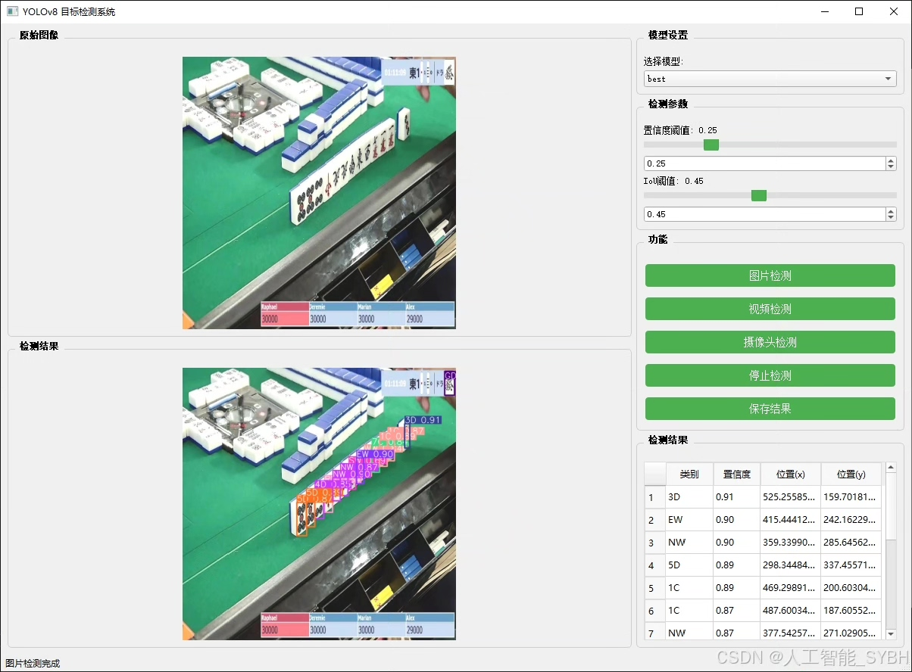
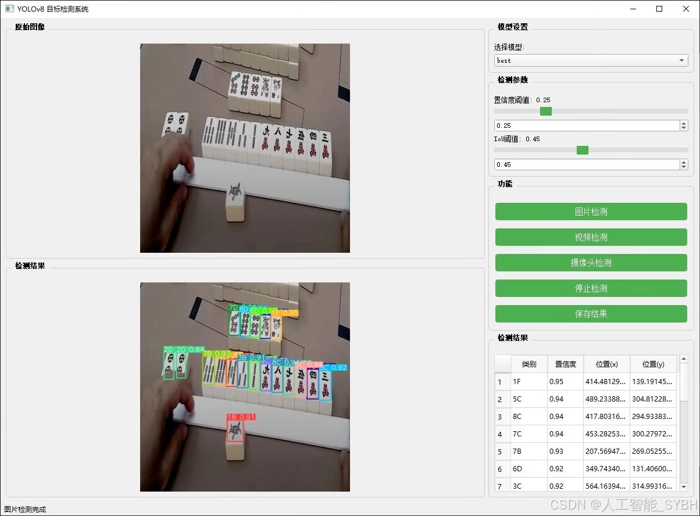
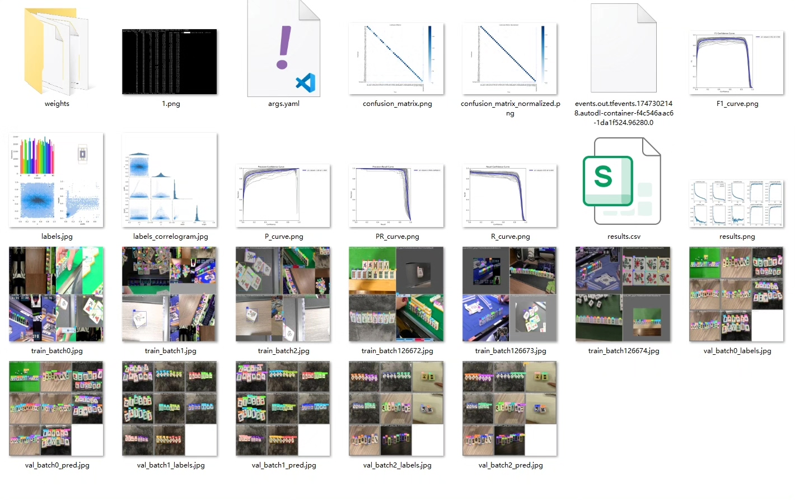
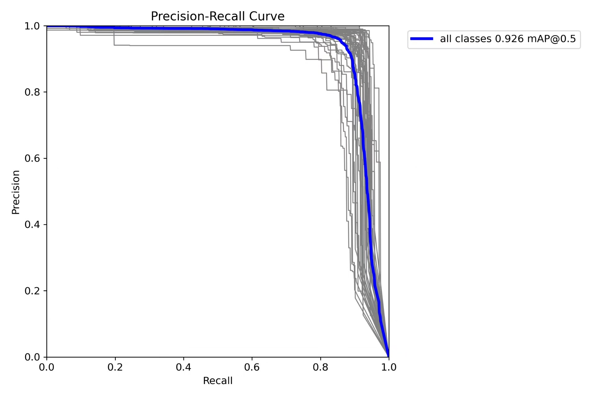
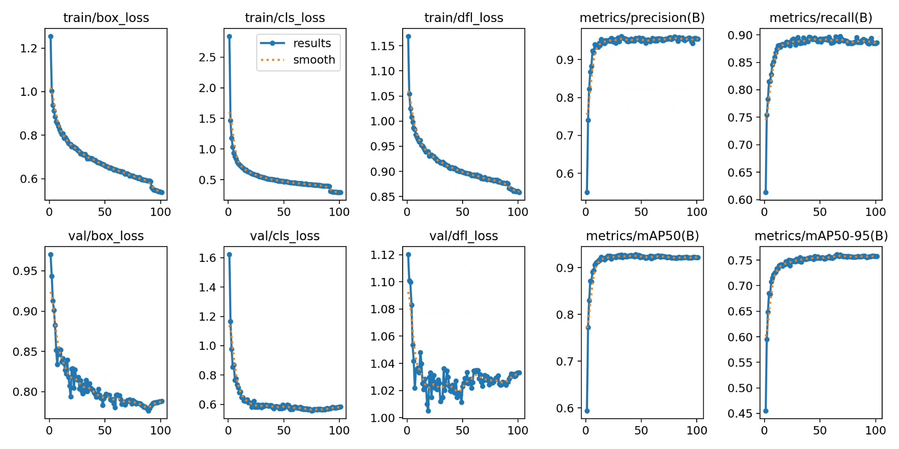
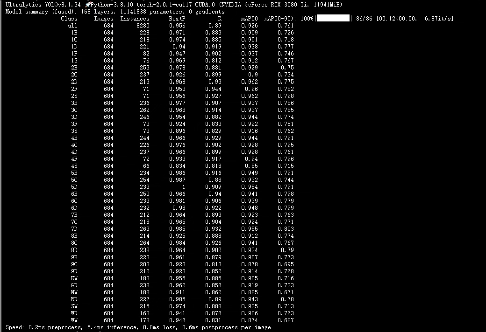
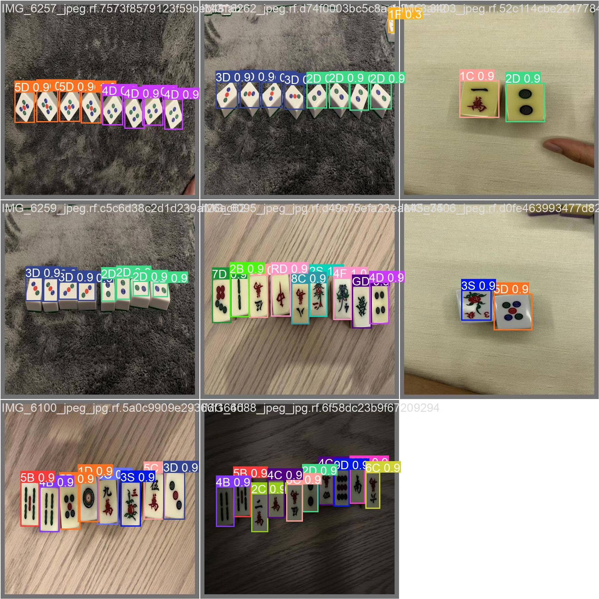
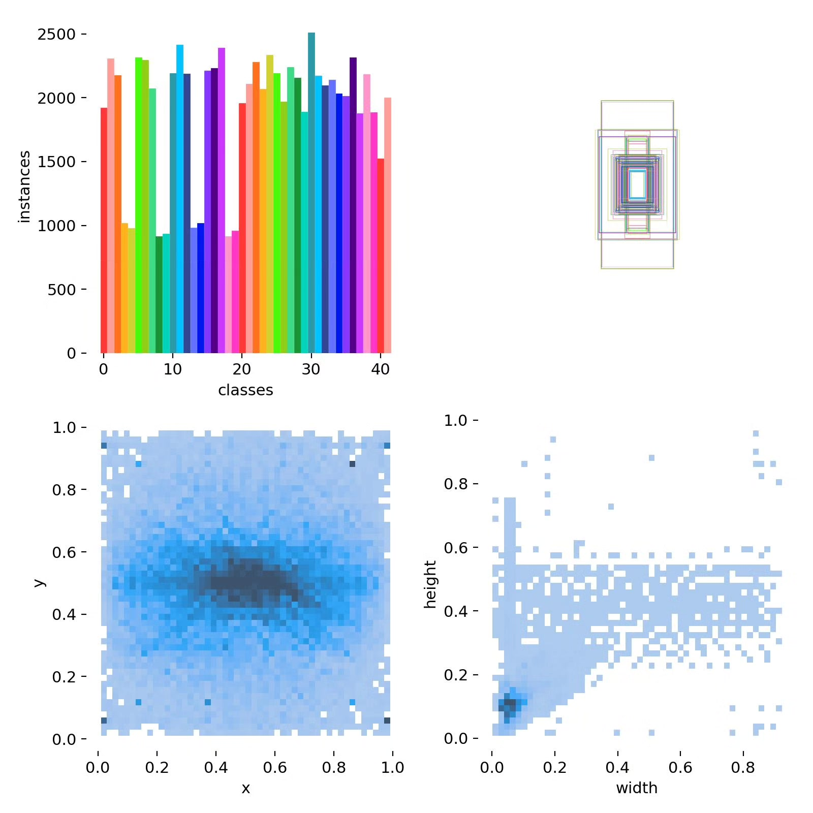

# Based on deep learning YOLOv8 for mahjong recognition detection system (YOLOv8+Y)

## Body

This project is based on the advanced YOLOv8 object detection algorithm, developing a set of intelligent detection systems specifically for mahjong tiles recognition. The system can accurately recognize and classify 42 different types of mahjong tiles, including Wanzi (1-9 Wan), Zhuzi (1-9 Zhu), Touzi (1-9 Tou), as well as special tile patterns such as Southeast Wind, Red Middle, Fortune, Whiteboard, etc. The project uses a dataset containing 6,731 labeled images, with 5,565 training sets, 684 validation sets, and 482 test sets, ensuring the model's generalization ability and recognition accuracy. This system achieves real-time detection and classification of mahjong tiles, fully meeting the needs of actual application scenarios.

The company's products have obtained YOLO official commercial license certification.

We provide after-sales service.

After payment, we will provide WeChat ID to answer questions at any time.

Environment configuration: We will provide an instructional tutorial for environment configuration, and WeChat will provide answers.

Remote installation service: If you need remote configuration, an additional fee of 69 is required,
if the configuration fails, all fees will be refunded (specially for old computers only refund installation fees)

Retraining dataset: After setting up the environment, you can train on your own computer.
If you need us to retrain, just pay 69+ computing power fees (2.5 yuan/hour)

## Images

## Payment

Here is a pay link on Stripe ( https://buy.stripe.com/3cs8yP7sY87d0vu9AB ). Please contact me lonlonago@foxmail.com after funding $89, and I will send you a complete data files , thank you!

